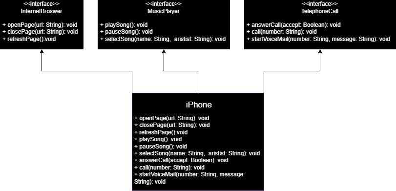

## Diagramação de classes do iPhone

Projeto para treinar a diagramação de classes tendo como base um iPhone. O projeto foi feito em Java e o diagrama foi feito no draw.io.

### Classes

A classe [`iPhone`](./src/iPhone.java) implementa as interfaces `InternetBrowser`, `MusicPlayer` e `TelephoneCall` e [`App`](./src/App.java) é a classe principal que instancia um objeto da classe `iPhone` e chama os métodos das interfaces implementadas.

```java
public class iPhone implements InternetBrowser, MusicPlayer, TelephoneCall {
    // ...
}
```

### Interfaces

- [`InternetBrowser` contém os métodos `openPage`, `closePage` e `refreshPage`](./src/phone/InternetBrowser.java).
- [`MusicPlayer` contém os métodos `playMusic`, `pauseMusic` e `selectMusic`](./src/phone/MusicPlayer.java).
- [`TelephoneCall` contém os métodos `call`, `answer` e `endCall`](./src/phone/TelephoneCall.java).

### Diagrama em UML


